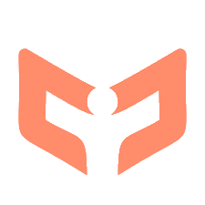
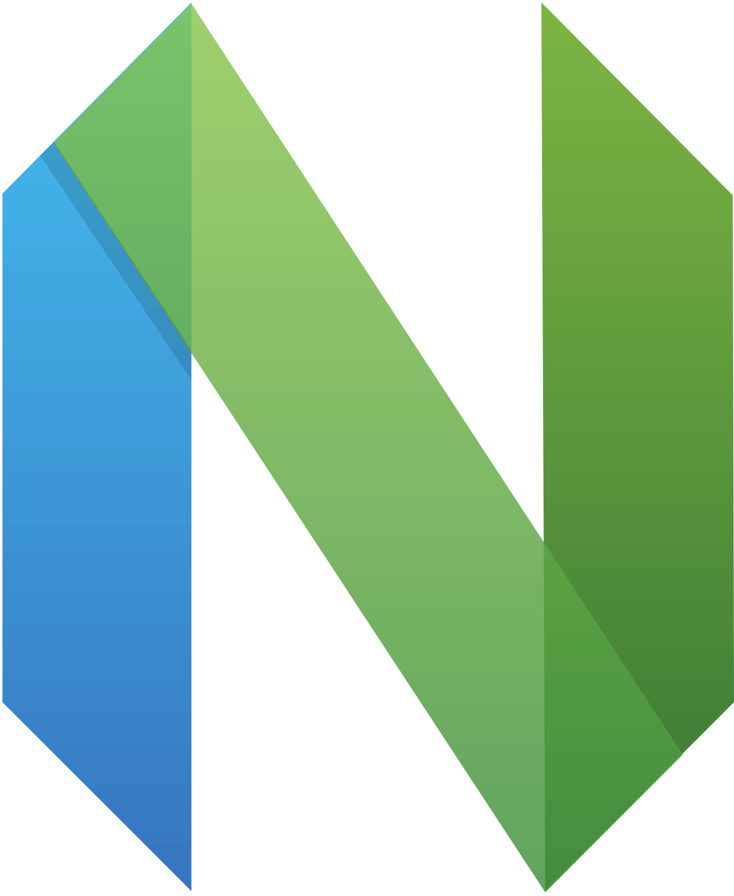
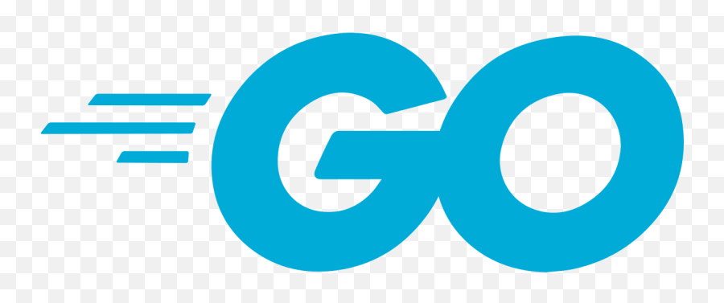

<h2> Hi, I'm Nic van Dessel! </h2>

<em>  Lead Unity Engineer at <a href="https://www.managexr.com/">ManageXR</a> building MDM for XR Devices</em>

<em>  Former Lead Unity Engineer at <a href="https://luminopia.com/">Luminopia</a></em>

<em> Former Director of Engineering (Unity) at <a href="https://www.mothandflamevr.com/">Moth + Flame </a></em>

&nbsp;&nbsp;&nbsp;

### What I'm Building

**[🧠 floop](https://github.com/nvandessel/floop)** 
* Brain-inspired memory system using spreading activation and neural concepts.
* Built for Claude workflows, expanding to broader agent contexts.
* Wrriten in Go.

**[🌴 frond](https://github.com/nvandessel/frond)**
* Agent-first CLI for managing stacked PRs with DAG dependencies on GitHub.
* Single binary, zero config, JSON output for agent integration.
* Written in Go.

**[🔗 go4dot](https://github.com/nvandessel/go4dot)**
* Cross-platform dotfile manager in Go with interactive setup, platform detection, and dependency management.
* Hobby project for making distro hopping easier to get up and running quickly.

**[🌉 claude-unity-bridge](https://github.com/ManageXR/claude-unity-bridge)** *(via ManageXR)*  
* Unity integration for AI agents.
* Connect Unity runtime with Claude.
* Focus on multi-agent and highly-parallel workflows.
* Python and C#.

**🎴 tablecloth** 
* A multiplayer card game system built to support a wide variety of games.
* Hobby project built with Unity and C#.

### How I'm working

Terminal-first development with tmux and nvim.
Enjoying [agent-deck](https://github.com/asheshgoplani/agent-deck).
Building with AI agents using parallel workflows and sub-agent orchestration.  

### Tech Stack

&nbsp;&nbsp;&nbsp;
&nbsp;&nbsp;&nbsp;
&nbsp;&nbsp;&nbsp;
&nbsp;&nbsp;&nbsp;

### Exploring

&nbsp;&nbsp;&nbsp;
&nbsp;&nbsp;&nbsp;
&nbsp;&nbsp;&nbsp;
&nbsp;&nbsp;&nbsp;

### Things I've contributed to

- [game-ci/unity-test-runner](https://github.com/game-ci/unity-test-runner)
- [VRMADA/ultimatexr-unity](https://github.com/VRMADA/ultimatexr-unity)

---

<em>Always learning.</em>

