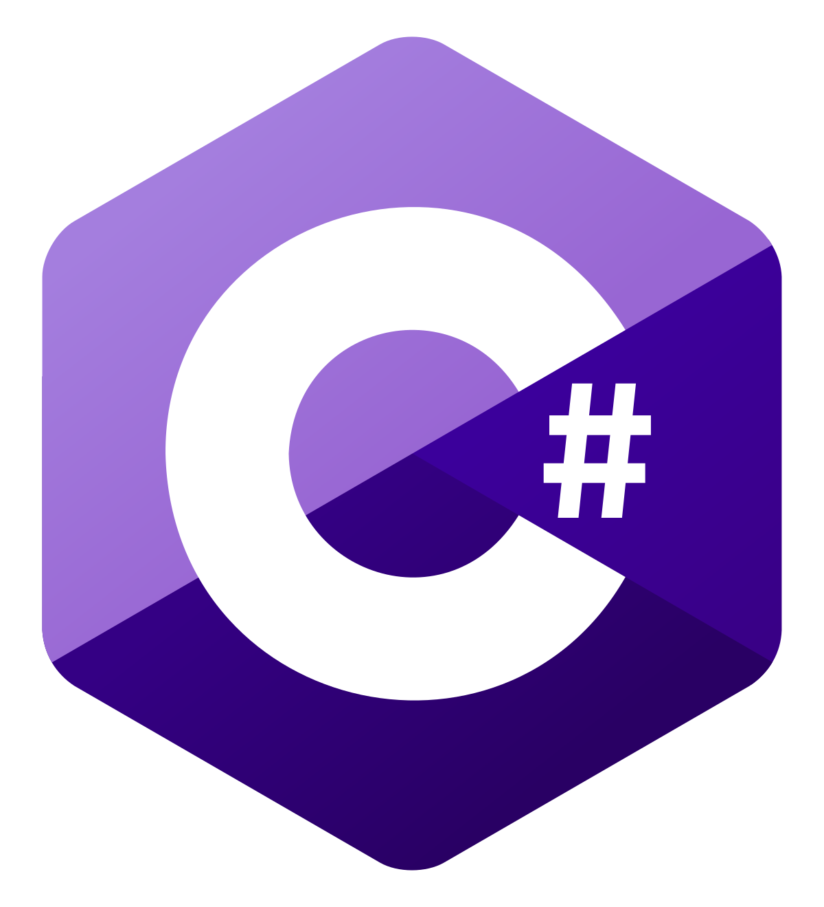
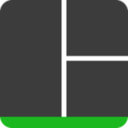
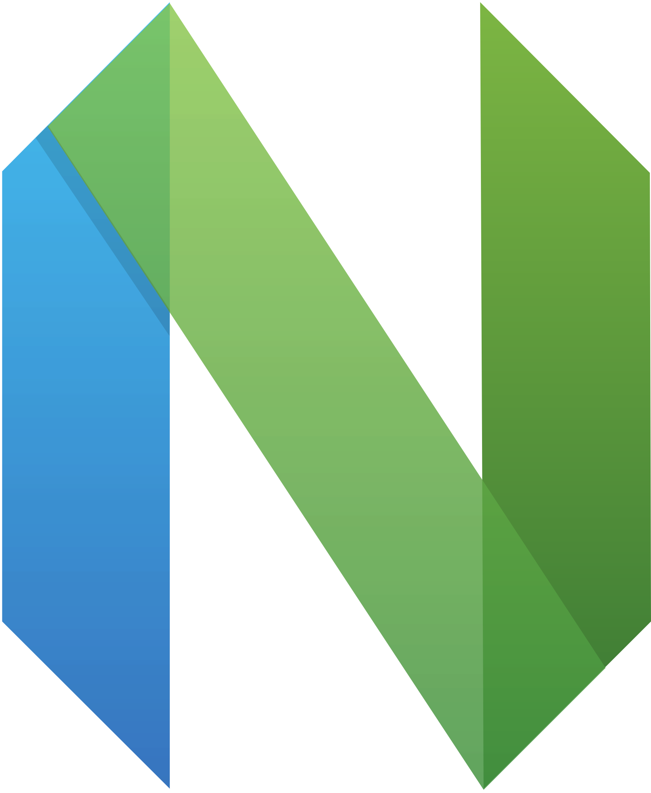
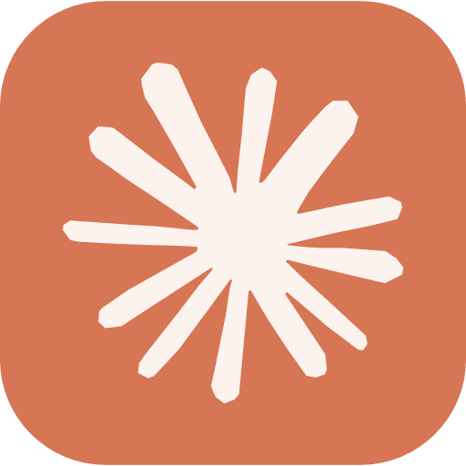

<h2> Hi, I'm Nic van Dessel! </h2>

<em>C#/Unity/XR engineer with 10+ years across headsets from the DK2 to enterprise MDM. Building open-source developer tools on the side in Go and Rust.</em>

&nbsp;&nbsp;&nbsp;

### What I'm Building

**[🧠 floop](https://github.com/nvandessel/floop)** — Spreading activation memory for AI coding agents.

**[⚡ sproink](https://github.com/nvandessel/sproink)** — Rust spreading activation engine with C FFI, extracted from floop.

**[🌴 frond](https://github.com/nvandessel/frond)** — Agent-first CLI for managing stacked PRs with DAG dependencies.

### Also Working On

**[📊 floop-bench](https://github.com/nvandessel/floop-bench)** — Open benchmark measuring floop's impact via SWE-bench Verified.

**[🧬 hippofloop](https://github.com/nvandessel/hippofloop)** — Distilled local model for floop consolidation.

**[🤝 team-up](https://github.com/nvandessel/team-up)** — Claude Code plugin for multi-agent team orchestration.

**[🔗 lancedb-go](https://github.com/lancedb/lancedb-go)** — Contributor to the LanceDB Go SDK.

### Expertise

<table>
<tr>
<td align="center"><a href="https://learn.microsoft.com/en-us/dotnet/csharp/"> C#</a></td>
<td align="center"><a href="https://unity.com/"> Unity</a></td>
</tr>
</table>

VContainer · NUnit · Moq · Rider · GitHub Actions

### Building With

<table>
<tr>
<td align="center"><a href="https://go.dev/"> Go</a></td>
<td align="center"><a href="https://www.rust-lang.org/"> Rust</a></td>
<td align="center"><a href="https://www.python.org/"> Python</a></td>
</tr>
</table>

### How I'm Working

<table>
<tr>
<td align="center"><a href="https://github.com/tmux/tmux"> tmux</a></td>
<td align="center"><a href="https://neovim.io/"> Neovim</a></td>
<td align="center"><a href="https://github.com/jesseduffield/lazygit"> lazygit</a></td>
<td align="center"><a href="https://claude.ai/claude-code"> Claude Code</a></td>
<td align="center"><a href="https://github.com/asheshgoplani/agent-deck"> agent-deck</a></td>
</tr>
</table>

[floop](https://github.com/nvandessel/floop) · [frond](https://github.com/nvandessel/frond)

### Things I've Contributed To

- [game-ci/unity-test-runner](https://github.com/game-ci/unity-test-runner)
- [VRMADA/ultimatexr-unity](https://github.com/VRMADA/ultimatexr-unity)
- [lancedb/lancedb-go](https://github.com/lancedb/lancedb-go)
- [nvandessel/hnsw](https://github.com/nvandessel/hnsw)
- [nvandessel/go4dot](https://github.com/nvandessel/go4dot)
- [ManageXR/claude-unity-bridge](https://github.com/ManageXR/claude-unity-bridge)

---

<em>Always learning.</em>

